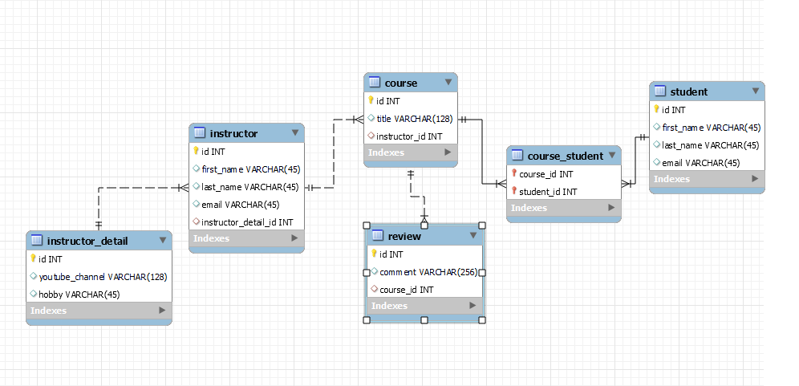

# Many to Many Relationship

In a many-to-many relationship, both entities can have many instances associated with one another.

```java
@Entity
@Table(name = "employee")
public class Employee {

    @Id
    @GeneratedValue(strategy = GenerationType.IDENTITY)
    private Long id;

    private String name;

    @ManyToMany(cascade = CascadeType.ALL)
    @JoinTable(name = "employee_project",
            joinColumns = {@JoinColumn(name = "employee_id")},
            inverseJoinColumns = {@JoinColumn(name = "project_id")})
    private Set<Project> projects = new HashSet<>();

    // getters and setters
}

@Entity
@Table(name = "project")
public class Project {

    @Id
    @GeneratedValue(strategy = GenerationType.IDENTITY)
    private Long id;

    private String name;

    @ManyToMany(mappedBy = "projects")
    private Set<Employee> employees = new HashSet<>();

    // getters and setters
}

```
-  The Employee entity has a Set of Project entities, which is mapped using the `````@ManyToMany````` annotation.
- The joinColumns attribute specifies the foreign key column(s) in the join table that reference the primary key column(s) of the Employee entity.
-  The ``inverseJoinColumns`` attribute specifies the foreign key column(s) in the join table that reference the primary key column(s) of the Project entity.
-  The ``mappedBy`` attribute is used to specify the name of the property in the Employee entity that maps the relationship.

<br>

