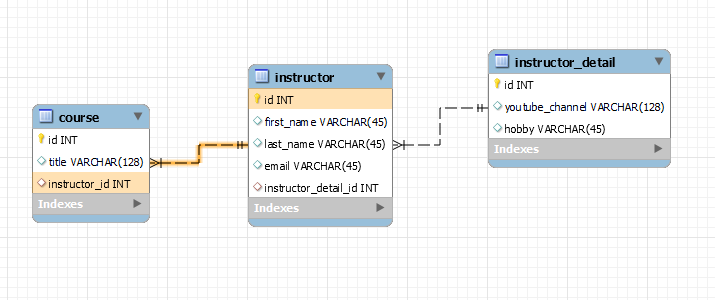

# One To Many Relationship

In a bidirectional ```@OneToMany``` relationship, the parent entity has a collection of child entities, and each child entity has a reference to its parent entity.

```java
@Entity
@Table(name = "department")
public class Department {

    @Id
    @GeneratedValue(strategy = GenerationType.IDENTITY)
    @Column(name = "id")
    private Long id;

    @OneToMany(mappedBy = "department", cascade = CascadeType.ALL, orphanRemoval = true, fetch = FetchType.LAZY)
    private List<Employee> employees = new ArrayList<>();

    // constructor, getters, setters, etc.
}

@Entity
@Table(name = "employee")
public class Employee {

    @Id
    @GeneratedValue(strategy = GenerationType.IDENTITY)
    @Column(name = "id")
    private Long id;

    @ManyToOne(fetch = FetchType.EAGER)
    @JoinColumn(name = "department_id")
    private Department department;

    // constructor, getters, setters, etc.
}

```
-  The **Department** entity has a collection of **Employee** entities, which is annotated with @OneToMany.
- The ``mappedBy`` attribute specifies that the Employee entity's department field should be used to map the relationship. This means that the Department entity does not have a **foreign key** column for the Employee entity in its table.
- **mappedBy** tells Hibernate
  - Look at the **department** property in the Employee class.
  - Use information from Employee class @JoinColumn.
  - To help find associated employee for department.
- The ``orphanRemoval`` attribute specifies that when an Employee entity is removed from the employees collection, it should also be deleted from the database.
- The Employee entity has a reference to its parent Department entity, which is annotated with ```@ManyToOne```. The **JoinColumn** annotation specifies the name of the foreign key column in the employee table that references the id column in the department table.
<br>
</br>



<br>

## Eager Vs Lazy Loading

- **Eager** loading means that when an entity is loaded from the database, all of its associated entities are also loaded at the same time(  ``slower performance`` and ``larger memory usage``).

- **Lazy** loading means that associated entities are not loaded from the database until they are accessed for the first time.

- By default, **JPA** uses lazy loading for **@ManyToOne**, **@OneToMany**, and **@ManyToMany** associations, but eager loading can also be used by setting the fetch attribute to ``FetchType.EAGER``.

Example:
```java
@ManyToOne(fetch = FetchType.EAGER)
@JoinColumn(name = "department_id")
private Department department;
```
